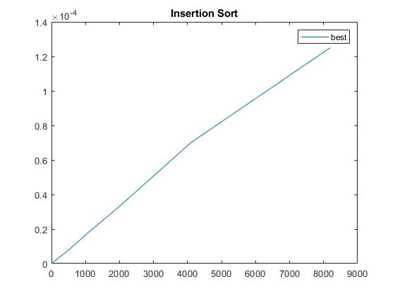

# AD_HW_05
Homework for the course Algorithm design at the DSSC course at the University of Trieste. 2019-2020

03/06/2020

Now to move to the next homework.

--------------------------------------------------------
04/06/2020

I had some issues with underflowing when using size_t variables, so quick_sort, quick_sort_select and select_index use int variables for the indexes.

The sorting algorithm I implemented last was heapsort. I copied libbinheap.so in the folder and I added the adress to CMakeLists.txt. And then it worked. Make correctly imported the library and used it.
However I had to create a secondary array void* B to build the array on. Otherwise the elements of A could have been modified and so the indexes of the heap nodes could have been misdirective. We fill A from left to right and we empty  the heap by leaving all the elements in B in their order. As I said in AD_HW_04 my implementation of binary heaps with no swapping in A does insert new keys in A but does not delete them when we extract.

-------------------------------------------------------

06/06/2020
I am facing another problem. Quicksort + select is too much slower than regular quicksort, while in theory it should be faster.
The output is: 

Size    Quick Sort    Quick Sort + Select
        (Random Case)  (Random Case)  
2^2     0.000001        0.000001
2^3     0.000002        0.000004
2^4     0.000004        0.000011
2^5     0.000011        0.000026
2^6     0.000026        0.000075
2^7     0.000063        0.000162
2^8     0.000392        0.000532
2^9     0.000826        0.001521
2^10    0.001533        0.003174
2^11    0.002763        0.006795
2^12    0.006443        0.014264
2^13    0.014782        0.034540
2^14    0.037084        0.102601
2^15    0.119878        0.382744
2^16    0.422156        2.530437

One of my classmates suggested me to implement the triple partition, so I will move on to that.

------------------------------------------------------------------
07/06/2020

I managed to implement the G-E-S partition, and now the quicksort+select is much faster than before. In addition in the worst case scenario it is better than the regular quicksort.

        Size    Quick Sort                      Quick Sort + Select
               (Random Case)   (Worst Case)    (Random Case)   (Worst Case)
        2^2     0.000001        0.000001        0.000001        0.000001
        2^3     0.000002        0.000003        0.000005        0.000004
        2^4     0.000005        0.000007        0.000011        0.000010
        2^5     0.000014        0.000021        0.000027        0.000024
        2^6     0.000034        0.000061        0.000070        0.000068
        2^7     0.000074        0.000178        0.000461        0.000359
        2^8     0.000181        0.001078        0.000648        0.000660
        2^9     0.000721        0.002151        0.001315        0.001369
        2^10    0.001423        0.004474        0.002921        0.002570
        2^11    0.002197        0.011699        0.005016        0.005269
        2^12    0.004270        0.033644        0.009971        0.014135
        2^13    0.010933        0.109114        0.020427        0.039742
        2^14    0.030098        0.285695        0.039994        0.055145
        2^15    0.033165        0.716740        0.080172        0.119935
        2^16    0.063963        2.023896        0.162988        0.262389
        2^17    0.118724        5.685116        0.324952        0.556615
        2^18    0.239599        16.343572       0.670234        1.214319
        2^19    0.461615        45.511110       1.313441        2.618801
        2^20    0.910542        131.203797      2.641109        5.794000

The complete output is: 

        Size    Insertion Sort                          
                (Random Case)   (Best Case)     (Worst Case)
        2^2     0.000000        0.000000        0.000001
        2^3     0.000001        0.000000        0.000002
        2^4     0.000007        0.000000        0.000010
        2^5     0.000021        0.000000        0.000042
        2^6     0.000087        0.000001        0.000387
        2^7     0.000462        0.000002        0.001202
        2^8     0.002210        0.000005        0.003517
        2^9     0.006341        0.000007        0.011505
        2^10    0.023779        0.000015        0.046042
        2^11    0.139570        0.000031        0.221156
        2^12    0.358553        0.000062        0.713598
        2^13    1.427546        0.000389        2.853443

        Size    Quick Sort                      Quick Sort + Select
                (Random Case)   (Worst Case)    (Random Case)   (Worst Case)
        2^2     0.000001        0.000001        0.000001        0.000001
        2^3     0.000002        0.000003        0.000005        0.000004
        2^4     0.000005        0.000007        0.000010        0.000010
        2^5     0.000014        0.000023        0.000026        0.000026
        2^6     0.000033        0.000061        0.000069        0.000062
        2^7     0.000076        0.000174        0.000162        0.000156
        2^8     0.000189        0.001067        0.000817        0.000646
        2^9     0.000668        0.002938        0.001592        0.001746
        2^10    0.001665        0.008093        0.003612        0.002687
        2^11    0.003484        0.012892        0.004857        0.005248
        2^12    0.006950        0.033596        0.009832        0.011368
        2^13    0.008897        0.090591        0.021479        0.025011

        Size    Insertion Sort  Quick Sort      Bubble Sort     Selection Sort  Heap Sort
              (Random Case)   (Random Case)
        2^2     0.000000        0.000001        0.000000        0.000000        0.000002
        2^3     0.000001        0.000002        0.000002        0.000001        0.000002
        2^4     0.000009        0.000007        0.000008        0.000003        0.000005
        2^5     0.000026        0.000019        0.000033        0.000013        0.000011
        2^6     0.000091        0.000033        0.000106        0.000036        0.000019
        2^7     0.000609        0.000077        0.000980        0.000121        0.000044
        2^8     0.002603        0.000470        0.003373        0.000764        0.000389
        2^9     0.007956        0.000735        0.008644        0.002325        0.000319
        2^10    0.025336        0.001679        0.035794        0.007876        0.000728
        2^11    0.091742        0.002319        0.153122        0.029634        0.001476
        2^12    0.359016        0.004190        0.655655        0.116962        0.002648
        2^13    1.426523        0.007516        2.724246        0.459631        0.005450

        Size    Quick Sort      Quick Sort +    Heap Sort
                          Select
             (Random Case)   (Random Case)   (Random Case)
        2^14    0.018333        0.039365        0.010618
        2^15    0.031096        0.079567        0.022065
        2^16    0.061550        0.168271        0.048183
        2^17    0.124221        0.341484        0.118580
        2^18    0.242788        0.691352        0.248466
        2^19    0.462482        1.309145        0.572775
        2^20    0.905675        2.603716        1.630880

----------------------------------------------------------
If we graph the above information we get:

A particular of the above graph is:

Then we can compare quicksort and quicksort+select:

Comparing the sorting methods gives:

If we get a particular of the above graph we have:

